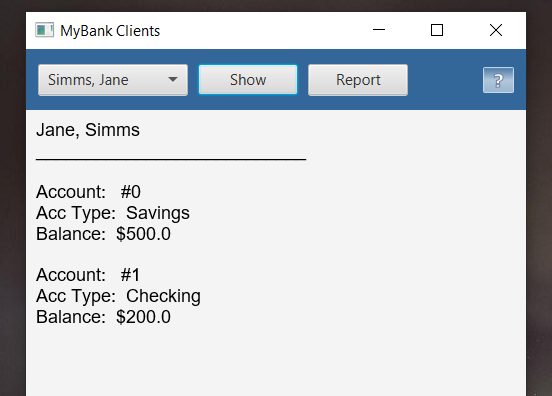
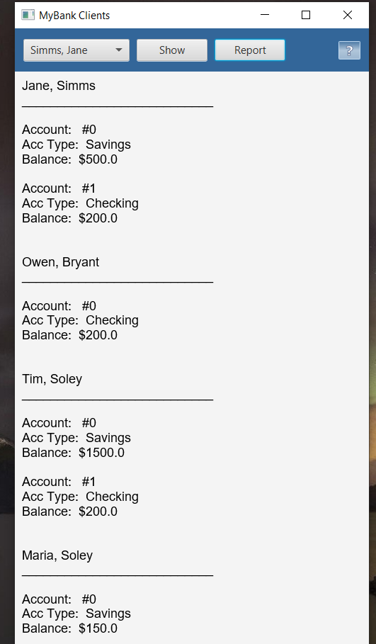

# Результат

## На "п'ять"
1. З файлу test.dat зчитується інформація про клієнтів банку та їх рахунки
2. При виборі клітаєнта натисненні кнопки Show виводиться інформація про нього та всі його рахунки
3. Додано до форми кнопку Report, яка виводить у нижній частині вікна звіт за клієнтами.
